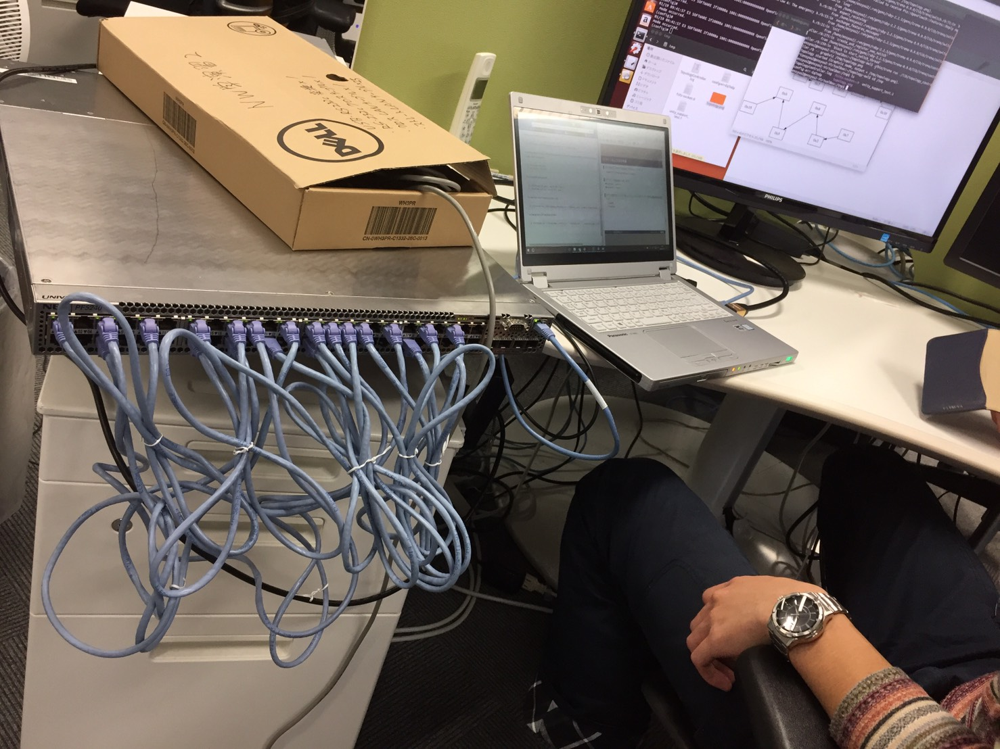
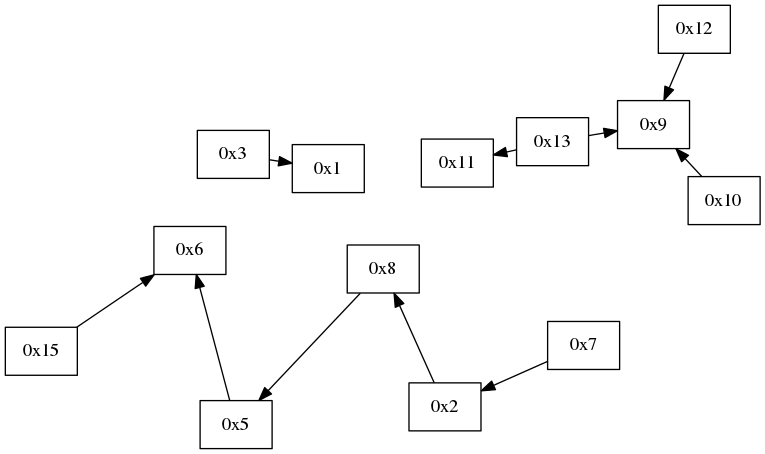
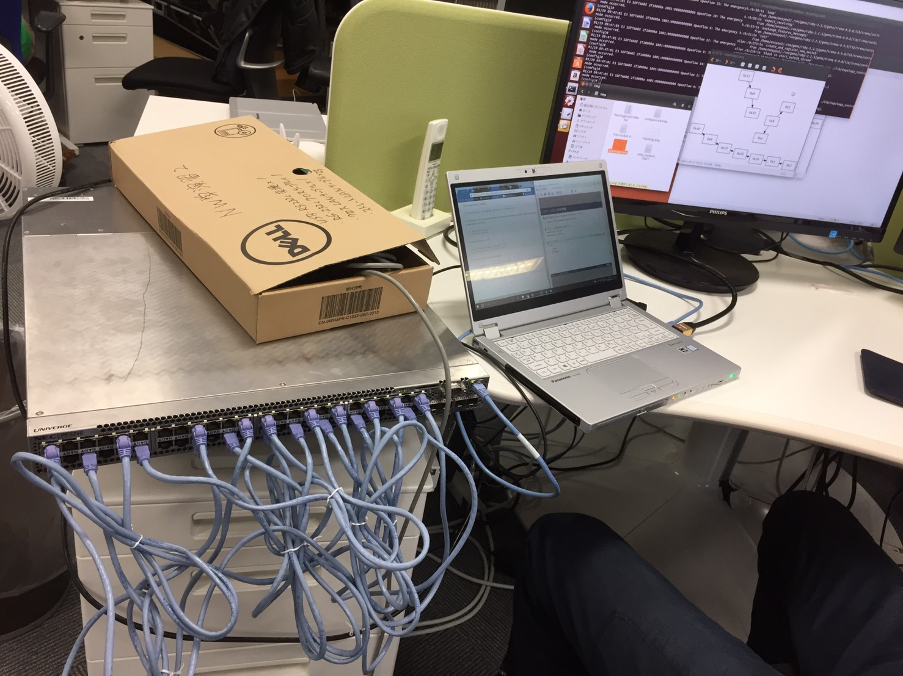
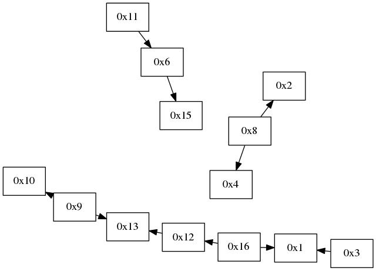
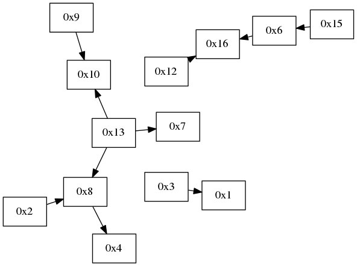
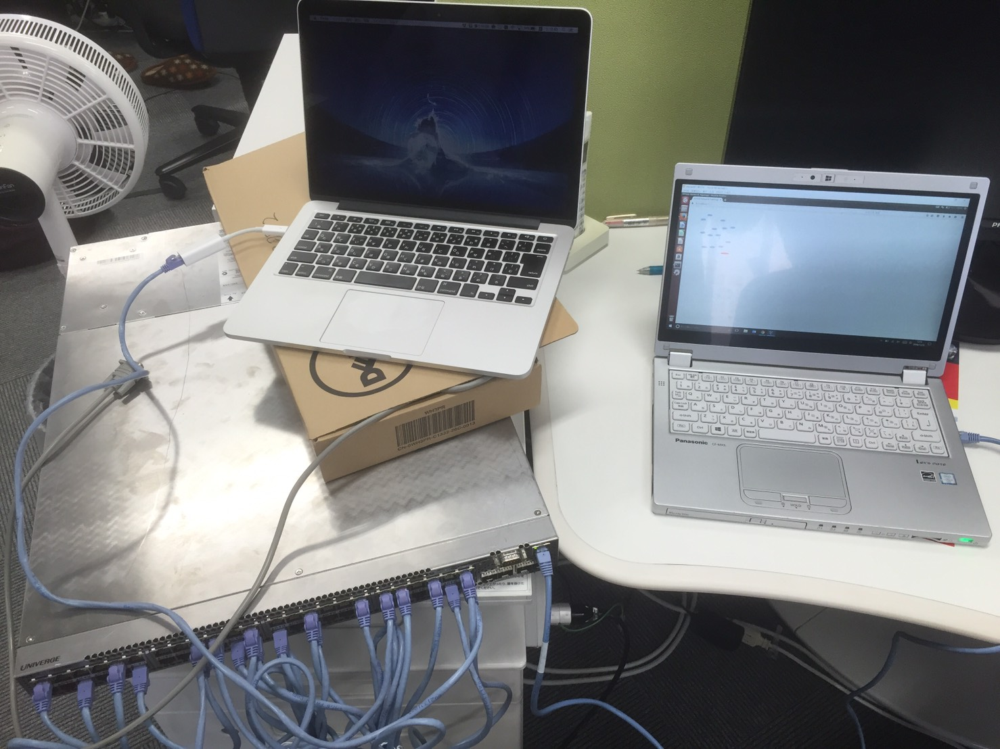
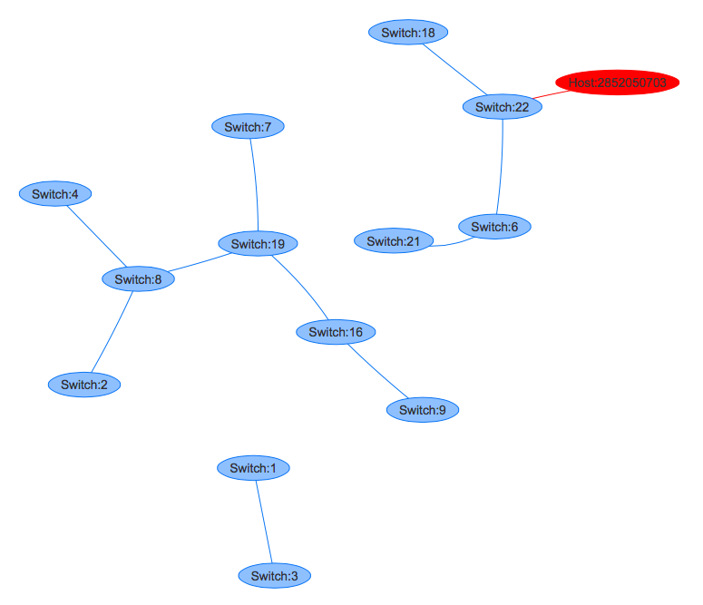
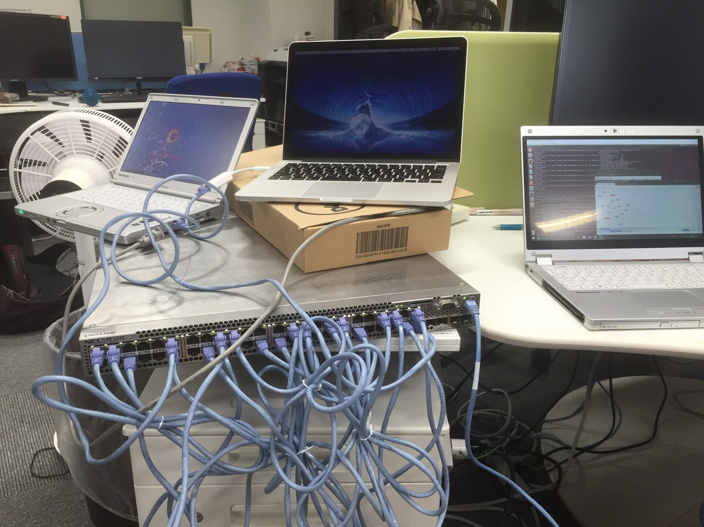
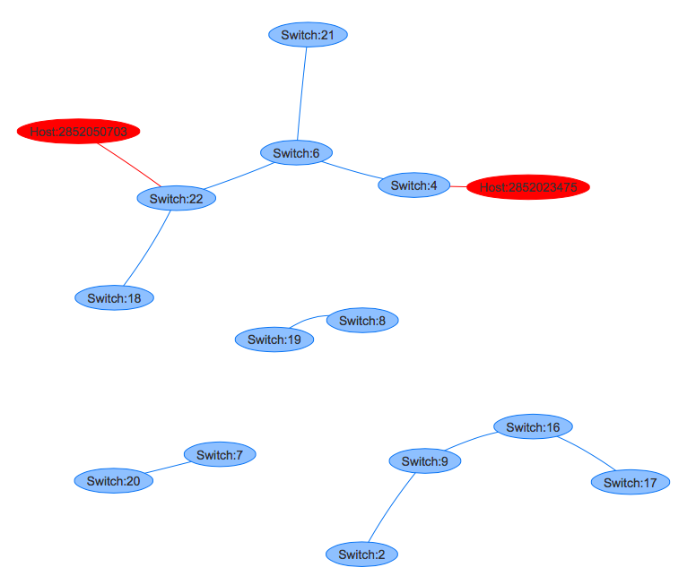

#情報ネットワーク学演習II 11/9 レポート課題
===========
チーム名　owl  
メンバー 秋下 耀介、坂田 航樹、坂本 昂輝、佐竹 幸大、田中 達也、Jens Oetjen、齊藤 卓哉  

## 役割分担
* 実機スイッチの設定、実行　田中
* 課題2のプログラム作成　坂本、秋下
* 課題1のレポート作成　田中
* 課題2のレポート作成　坂本、秋下

## 課題１ (実機でトポロジを動かそう)

1. 実機スイッチ上に VSI x16 を作成 (各VSIは2ポート以上)
1. 全ポートを適当にケーブリング
1. Topologyを使ってトポロジを表示
1. ケーブルを抜き差ししてトポロジ画像が更新されることを確認  

レポートには次のことを書いてください。

* 表示できたトポロジ画像。何パターンかあると良いです
* ケーブルを抜き差ししたときの画像
* 実機スイッチのセットアップ情報。作業中の写真なども入れるとグーです


### 解答
#### 実機スイッチのセットアップ
本課題を取り組んだ際のセットアップについて記述する。
スイッチの初期設定は前回までに終了していたので、設定用端末設定から行った。

まず、コントローラーとして用いる端末で

```
$ sudo ip addr add 192.168.1.2/24 dev eth0
```

を入力した。
この際IPアドレスはPF5240のマネジメントポートと同じサブネットに属さなければならない。
この際、ネットワークを接続する必要がある。
うまく実行できなかったため、先生の助言の元、Ubuntuの「ネットワーク接続を編集する」から手動でIPアドレスを割り当てた。

続いて、設定用端末のVMよりtelnetでPF5240にアクセスするために以下のコマンドを入力する。

```
$ telnet 192.168.1.1
```

このIPアドレスは実機のIPアドレスである。
コンフィグレーションコマンドモードでVSIを作成する。
VSIは16個作成する。

まずVLAN定義を行う。

```
(config)# vlan <VLAN id>
(config-vlan)# exit
```

その後、インスタンス作成を行う。

```
(config)# openflow openflow-id <VSI id> virtual-switch
(config-of)# controller controller-name cntl1 1 <IP address of controller> port 6653
(config-of)# dpid <dpid>
(config-of)# openflow-vlan <VLAN id>
(config-of)# miss-action controller
(config-of)# enable
(config-of)# exit
```

各変数には以下の値を入力した。
* <VLAN id> : 100,200,・・・,1600
* <VSI id> : 1,2,・・・,16
* <IP address of controller> : 192.168.1.2
* <dpid> : 0000000000000001,0000000000000002,・・・,0000000000000016

```
(config-of)# openflow-vlan <VLAN id>
```

を実行する際に、

```
!(config-of)# openflow-vlan 100
openflow : Can't set because the OpenFlow instance is enabled.
```

というエラーが出現した。
これは既に VSI (OpenFlow スイッチのインスタンス) が
enable 状態になっているため、設定変更できないという旨のエラーである。
そこで、

```
(config-of)# no enable
(config-of)# openflow-vlan <VLAN id>
(config-of)# enable
```

と入力することにより、VSIを一旦disableにしてから設定を行い、enable状態にする。

続いて作成した各VSIにポートをマップする。

```
(config)# interface range gigabitethernet 0/<from_port>-<to_port>
(config-interface)# switchport mode dot1q-tunnel
(config-interface)# switchport access vlan <VLAN id>
```

今回VSIは16個であり、実機のポートは48個であったので、各VSIに3ポートずつマップした。

以上の設定が終了したあと、

```
(config)# save
```

で設定の有効化を行った。

#### 実行結果
まず、実機ポートの接続画像を以下に示す。

このポート接続に対して、

```
$ ./bin/trema run ./lib/topology_controller.rb　-- graphviz /tmp/topology.png
```

でトポロジ画像を出力した。
graphvizはapt-getでインストールする必要がある。
この時、ネットワーク設定を変更する必要がある。(実機と接続するためのネットワーク設定のままではインストールできない。)
出力したトポロジ画像は以下である。


続いて、実機ポートのケーブルを適当に抜き差しし、接続を変更した
この際の、実機ポートの接続画像を以下に示す。


```
$ ./bin/trema run ./lib/topology_controller.rbf -- graphviz /tmp/topology2.png
```

と入力して、トポロジ画像を出力した。
出力したトポロジ画像は以下である。

トポロジ画像が変更されていることがわかる。

さらに実機ポートのケーブルを適当に抜き差しし、接続を変更した場合のトポロジ画像を以下に示す。


## 課題2 (トポロジコントローラの拡張)
* スイッチの接続関係に加えて、ホストの接続関係を表示する
* ブラウザで表示する機能を追加する。おすすめは vis.js です

### 実装
本機能の実装を以下の２つに切り分けた。

* トポロジ情報の取得（プログラムの解読）およびテキストファイル出力(担当：秋下)
* テキスト情報に基づいたvis.jsによるトポロジの表示（担当：坂本）  
それぞれについての説明を以下に示す。


#### <a id="txt_format" style="color: black;">トポロジ情報のテキストファイル出力</a>

ここでは、配布されたtopology.rbなどに変更を加え、トポロジ情報の出力を行う。
次節で実際にトポロジの出力を行うが、そのための入力テキストファイルとして、lib/view/配下に以下のようなテキストファイルを作成するものとした。
ノード情報（スイッチ、ホスト）は、

```
1	Switch:1
2	Switch:2
...
10	Switch:10
host
11	Host:11
12	Host:12
...
```

のようになっており、１列目がID、２列目がラベルを表している。今回はスイッチとホストの区別を行うために、区切り文字として「host」を書き込んでいる。
また、リンク情報は、

```
...
link
1	4
2	8
...
15	3
16	4
...
```

のようになっており、１列目が送信元ノードのID、２列目が宛先ノードのIDを表している。すなわち、そのノード同士が接続されていることが読み取れるようになっている。ただし、無向グラフとして定義してる。ここでは、リンク情報の前にノード情報が記述されているため、区切り文字として「link」を書き込んでいる。

上記のようなファイルを出力するにあたって、まず以下のファイルを新規作成した。

* [lib/view/vis.rb](https://github.com/handai-trema/topology-owl/blob/master/lib/view/vis.rb)

また、以下のファイルに変更を加えた。

* [lib/command_line.rb](https://github.com/handai-trema/topology-owl/blob/master/lib/command_line.rb)

それぞれについて説明を行う。

##### lib/view/vis.rb
ここでは、トポロジの情報を実際にファイルとして書き出すメソッド等を実装した。
まず以下のように初期化メソッドを定義することで、出力ファイルはデフォルトでlib/view配下に作成するものとした。

```ruby
def initialize(output = 'lib/view/node.txt')
      @output = output
end
```

次に、テキストファイルへの書き出しを行うメソッドは以下のような実装とした。

```ruby
def update(_event, _changed, topology)
      # write node data
      File.open(@output, "w") do |file|
        
        #switch
        nodes = topology.switches.each_with_object({}) do |each, tmp|
          file.printf("%d Switch:%d\n",each.to_i, each.to_i)
        end
        #host
        file.printf("host\n")
        topology.hosts.each do |each|  #for all host
          file.printf("%d Host:%d\n",each[1].to_i, each[1].to_i)
        end

        @temp = Hash.new { [] }#check link
        #link of switches
        file.printf("link\n")
        topology.links.each do |each|
          if checkLinkList(@temp,each.dpid_a.to_i,each.dpid_b.to_i )==true then
            file.printf("%d %d\n",each.dpid_a.to_i, each.dpid_b.to_i)
            @temp[each.dpid_a.to_i].push(each.dpid_b.to_i)
          end
        end
        #link between host and switch
        topology.hosts.each do |each|  #for all host
          if checkLinkList(@temp,each[1].to_i,each[2].to_i )==true then
            file.printf("%d %d\n",each[1].to_i, each[2].to_i)
            @temp[each[1].to_i].push(each[2].to_i)
          end
        end

      end
      
end
```

上記では、topology.txtへの出力を行っている。まずノード情報の書き込みでは、各スイッチおよび各ホストの要素をひとつずつ確認していく。
ここでノードの情報はそのノードIDがいくつであるかのみ分かれば良いため、IDおよびそのIDを用いたラベルを書き込む。
同様に、リンク情報の書き込みでは、各リンクの要素をひとつずつ確認する。このとき、checkListメソッドがtrueであれば、実際に書き込みを行う。そして、書き込んだ内容を@tempに保存する。ここで、linksにはスイッチ間のリンク情報しか保存されていないため、hostの要素をひとつずつ確認し、ホスト--スイッチ間のリンクも追加する。ただしこの時も同様に、checkListメソッドがtrueであれば書き込みを行う。

checkLinkListメソッドは、すでにファイルに書き込んだ内容および、今書き込もうとしている内容が重なってないかを判断するメソッドで、以下のようになっている。

```ruby
def checkLinkList(getList, a, b)
      getList.each_key do |key|
        getList[key].each do |each|
          if (each == a && key==b) || (each == b && key==a) then
            return false
          end
        end
      end
   return true
end
```

上記は、まずgetListの各キーを取得し、それらを用いて実際に保存されいてる各配列要素を確認していくものとなっている。そして、キーと配列要素が一致していた場合は、すでに書き込みが終わっている要素の組み合わせであるから、falseを返す。もし保存された要素の中に存在しなかった場合はtrueを返す。


##### lib/command_line.rb
ここでは、コマンドラインから今回実装したテキストファイルへの出力コマンドを実装できるよう、`define_graphviz_command`メソッドを参考にして以下のメソッドを追加した。

```ruby
  def define_vis_command
    desc 'Displays topology information (vis mode)'
    arg_name 'output_file'
    command :vis do |cmd|
      cmd.action(&method(:create_vis_view))
    end
  end
```

また、合わせてparseメソッドに上記メソッドを書き込んだ。そして`create_graphviz_view`と同様にして以下のprivateメソッドを定義した。

```ruby
def create_vis_view(_global_options, _options, args)
    require 'view/vis.rb'
    if args.empty?
      @view = View::VisJs.new
    else
      @view = View::VisJs.new(args[0])
    end
 end
```

これによって、vis.rbが表示形式として選択されるようになる。


#### vis.js によるトポロジーの表示
ここでは、出力されたトポロジー情報のテキストファイルを読み込み、それを基に vis.js を用いてブラウザ上でトポロジーを表示する。vis.js を利用するにあたって、本来は html ファイルを作成し、これをブラウザ上で実行することによって vis.js で出力されたトポロジー図が可視化される。しかし、html ファイル上で動作する JavaScript では、セキュリティの問題上ローカルファイルを静的に指定することはできない。そこで、テキストファイルを読み込むために、以下のような解決策が考えられる。

* Ruby からトポロジーを表示する html ファイルを作成する。
* input タグにより指定されたファイルを読み込む。
* PHP を利用してテキストファイルを読み込む。
* Node.js を利用してテキストファイルを読み込む。

しかし、1つ目は html ファイルを作成して毎回開かなければならず、2つ目はパス入力や UI によるファイル選択の手間がかかり、3つ目は PHP の環境構築に手間がかかり、また言語が1つ増えることによりプログラムコードが煩雑となる。それらに対して、4つ目は JavaScript のみで実装することができ、またブラウザの更新ボタンを押すだけでトポロジー情報の変更が反映される。以上に挙げた欠点・利点はどれもプログラム作成者側の都合であるが、よりシンプルで高品質なプログラムを作成するためには重要な考え方であると思う。よって、以降では4つ目のアプローチに従い、プログラムを作成した。プログラムは、./lib/view/ 配下の topology.js というファイルに記述した。

* [lib/view/topology.js](https://github.com/handai-trema/topology-owl/blob/master/lib/view/topology.js)

以降では、Node.js の簡単な説明の後、topology.js の内容を説明する。

##### Node.js

Node.js はオープンソースのサーバーサイド用プラットフォームである。特徴としては以下のものが挙げられる。

* サーバーサイドの JavaScript
* ノンブロッキング I/O (I/O の処理結果を待たず、非同期で処理を進める。I/O 処理の終了後コールバック関数を実行する。)
* イベントドリブン
* シングルスレッド
* JavaScript エンジンが Google の V8 で高速（[パフォーマンス比較の結果](http://blog.carlesmateo.com/2014/10/13/performance-of-several-languages/)、C よりは遅いが PHP より速い）

本課題では、Node.js を用いてローカルサーバーを起動し、ブラウザからローカルホストを指定して vis.js でトポロジーを表示する。

##### topology.js

topology.js の大枠は以下の通りである。

```javascript
var http = require('http');
http.createServer(function (request, response) {
  var url = request.url;
  if('/' == url){
---------------------------------------------------------
                 初期リクエストに対する処理
---------------------------------------------------------
  } else if('/vis.js' == url) {
---------------------------------------------------------
                vis.js 取得要求に対する処理
---------------------------------------------------------
  } else if('/vis.css' == url) {
---------------------------------------------------------
                vis.css 取得要求に対する処理
---------------------------------------------------------
  }
}).listen(8174);
console.log('Server running at http://127.0.0.1:8174/');
```

ここでは、HTTP サーバーを立ち上げている。具体的には、http オブジェクトを作成し、http.createServer により HTTP サーバーを作成する。.listen によりポート番号を指定しており、ここでは 8174 番としている。.createServer の引数に関数を渡すことで、サーバー起動後の処理を記述することが可能である。また、その関数にも request と response の引数があり、request はクライアントからのリクエスト情報に対する機能をまとめたオブジェクト、response はサーバーからクライアントに渡す機能をまとめたオブジェクトである。

HTTP サーバー起動後、サーバー側のコンソールに Server running at http://127.0.0.1:8174/ と表示する。127.0.0.1 は IPv4 において localhost を指すため、クライアント側はブラウザから http://localhost:8174/ にアクセスすれば応答が返ってくる。

次に、上述した関数の中を見ていく。関数の中では、まずクライアントが何を要求しているかを判別し、それに従ってそれぞれの処理を定義する。何を要求しているかどうかは、クライアントが要求する URL を見ることでわかる。本課題では、クライアントからの要求に対する処理は以下の３通りである。

1. 初期リクエストに対する処理
2. vis.js 取得要求に対する処理
3. vis.css 取得要求に対する処理

1.はクライアントがサーバーに初めてリクエストを送った時の処理で、クライアントがブラウザで html を構築するための情報を送る。2.は html 内で使用する vis.js を転送する。vis.js は vis でトポロジー図を表示するために必要な JavaScript ライブラリである。3.は html 内で使用する vis.css を転送する。vis.css は vis でトポロジー図を表示するために必要な vis 標準のスタイルシートである。

サーバー・クライアントモデルでは、基本的にクライアントで実現可能な処理はクライアントで実行される。これは、サーバーの負荷をできる限り緩和するためである。しかし、今回のコードでは、vis.js と vis.css をわざわざサーバーがクライアントに転送している。理想的には、クライアント側で、topology.js で稼働するサーバー以外の外部から vis.js と vis.css を取得するべきであるが、本課題ではほとんど不可能であると判断した。これは、実機と接続するホストコンピューターがネットワーク構成として実機の情報を用いるため、その間インターネット接続を遮断するためである。したがって、上記のように要求を判別することで、ローカルに閉じるようにプログラムを組んだ。（ただし、複数のネットワーク構成を同時に利用できれば可能であるかもしれない。）

###### 初期リクエストに対する処理
では、【初期リクエストに対する処理】を説明する。【初期リクエストに対する処理】は以下のような構造をとる。

```javascript
---------------------------------------------------------
                     data 整形部分
---------------------------------------------------------
  response.writeHead(200, {'Content-Type': 'text/html'});
  response.write(data);
  response.end();
```

【 data 整形部分】は後ほど説明を記載するが、ここで留意しておくこととしては、 data は html を記述した文字列ということである。したがって、data を編集することによって、html を操作する。response.writeHead はクライアントにヘッダー情報を渡す。第１引数は HTTP ステータスコード、第２引数はヘッダー情報をまとめた連想配列である。HTTP ステータスコードの意味は以下の通りである。

* 100 ~ 199 : 案内
* 200 ~ 299 : 正常処理
* 300 ~ 399 : サーバー移転通知
* 400 ~ 499 : クライアントにおける処理失敗
* 500 ~ 599 : サーバーエラー

ここでは 200 を渡しているため、リクエストに対して正常処理が行われたことを指す。また、html のデータを返すため、Content-Type には text/html を指定する。response.write(data) により、クライアントに data に格納された html データを渡す。クライアントはこの html データを元にブラウザに vis.js を用いたトポロジー図を構築する。response.end() はレスポンス処理を終えたことを意味する。

###### data 整形部分

以降では、【 data 整形部分】を説明する。【 data 整形部分】の大枠は以下の通りである。

```javascript
  var fs = require('fs');
  var rs = fs.createReadStream('./topology.txt');
  var readline = require('readline');
  var rl = readline.createInterface(rs, {});
---------------------------------------------------------
                      残る変数宣言
---------------------------------------------------------
  rl.on('line', function(line) {
---------------------------------------------------------
                      １行ずつ処理
---------------------------------------------------------
  }).on('close', function(){
---------------------------------------------------------
                     全行処理後の処理
---------------------------------------------------------
  });
```

ここでは、サーバーのローカルディレクトリにあるテキストファイルを読み取り、１行ずつ適切な処理を行った後、data に html データを格納する。

fs ~ rl の変数は、ファイル読み取りに必要な変数である。具体的には fs でファイルストリーム関連の機能をまとめたオブジェクトを作り、.createReadStream で topology.js と同じディレクトリにある topology.txt を読み取る。readline は１行ずつ処理するために必要な機能がまとめられたオブジェクトであり、それを用いて topology.txt 用の１行処理オブジェクトを作成する。

rl.on('line', function(line){}) では１行毎の処理を定義する。rl.on の第１引数 line により、１行毎であることを明記している。処理は関数内に定義する。function の第１引数に１行の文字列が格納されて渡される。なお、特にループ文を使用しなくとも、読み込んだファイルは全行に渡って１行ずつ処理される。

.on('close', function(){}) では、全行の処理が終わった後に実行されるコールバック関数を定義する。第１引数 close により、全行処理後の処理であることを明記している。処理は関数内に定義する。

以上の機構を用いて、残る３つの部分で data を整形していく。概要としては、【残る変数宣言】にて data 整形に必要なインデックス変数等を定義し、【１行ずつ処理】にて split メソッドにより読み込んだテキストファイルの内容に意味づけを行った後、【全行処理後の処理】にて data を作成する。

###### data の構造

それぞれを説明する前に、data の構造を見ておく。

```javascript
    var data = '<!doctype html>'+
'<html>'+
'  <head>'+
'    <title>Virtual Network Topology</title>'+
'    <script src="http://visjs.org/dist/vis.js"></script>'+
'    <link href="http://visjs.org/dist/vis.css" rel="stylesheet" type="text/css" />'+
'    <style type="text/css">'+
'      body, html {'+
'        font-family: sans-serif;'+
'      }'+
'    </style>'+
'  </head>'+
'  <body>'+
'    <div id="mynetwork"></div>'+
'    <script type="text/javascript">'+
'      var nodes = ['+
nodeData+
'      ];'+
'      var edges = ['+
linkData+
'      ];'+
"      var container = document.getElementById('mynetwork');"+
'      var data = {'+
'        nodes: nodes,'+
'        edges: edges'+
'      };'+
'      var options = {'+
"        width: '100px',"+
"        height: '100px'"+
'      };'+
'      var network = new vis.Network(container, data, options);'+
'    </script>'+
'  </body>'+
'</html>';
```

data は一般的な文字列である。最低限の可読性を確保するため、html ファイルの各行を js ファイルの各行に対応させ、連結した形である。

ヘッダーにはタイトルを指定し、vis でトポロジーを表示するための JavaScript と CSS ファイルを外部から読み込む。最低限フォントの一貫性を確保するため、新たに font-family を指定しておく。

ボディでは div タグで vis のトポロジー図が表示される部分を用意し、script タグでノードやリンク等の必要な情報を vis で定義されたメソッドに渡すことで、div タグにトポロジー図を表示する。留意点として、nodeData と linkData がある。nodeData はスイッチやホストを指し、linkData はリンクを指す。それぞれは以下のような連想配列となる。

<a id="node_link_data"></a>

```javascript
nodeData = "{id:[number], label:[nodeName](, color:'red')}";
linkData = "{from:[number], to:[number]}";
```

nodeData の id は各ノードの id を指し、linkData の from や to に指定することで、リンクの繋がりを決定する。label は各ノードの名前を意味する。ここで、nodeData はスイッチとホストの両方を格納することに注意したい。すなわち、id や label がスイッチとホストで同じものを使用しないようにする。また、vis で表示する際、スイッチとホストの見た目が同じだと、スイッチとホストの区別がつけられないため、ホストには color:'red' を指定し、スイッチは青、ホストは赤のノードで表示する。なお、これらの変数自体は１個の文字列オブジェクトであり、これを data の一部として連結することで、スイッチ・ホスト・リンク情報を付与した html を作成している。

今回記述した data の構造は明らかに操作性が悪い。改善点として、別に html ファイルを用意しておき、その html ファイルをクライアントに直接渡すことは可能である。しかし、その場合さらにファイル読み込みが発生し、読み込み機構が入れ子になって無駄に複雑なコードになってしまう。また、html ファイルを先にクライアントに渡しておき、nodeData と linkData を後に送ってクライアント側で処理させることも可能ではあるが、その場合はテンプレートエンジンが必要となる。大規模な html ファイルでは後者のようにすべきであるが、今回の html は比較的小規模であるため、data の構造としては現状で最適であると思う。

###### 残る変数宣言

data 整形に必要な変数を以下のように宣言する。

```javascript
    var splitter = [];
    var nodejs = [];
    var lineIndex = 0;
    var hostBegin = 0;
    var linkBegin = 0;
```

各変数の名前、型、意味を以下の表にまとめる。なお、テキストファイルの形式は[この部分](#txt_format)に既述している。

|名前|型|意味|
|:-------------|:---------------|:-------------|
|splitter|Array|split 関数で分割された配列を格納する代替配列|
|nodejs|Array [Associative Array]|テキストファイルから読み込んだ情報を格納する配列|
|lineIndex|Int|１行処理するとインクリメントされる変数|
|hostBegin|Int|読み込んだテキストファイルの第何行からホストが始まるのかを格納する変数|
|linkBegin|Int|読み込んだテキストファイルの第何行からリンクが始まるのかを格納する変数|

###### １行ずつ処理

１行毎の処理を記載している。ここでは、１行の文字列を空白文字で分割し、nodejs に格納していく。

```javascript
    splitter = line.split(" ");
    if(splitter[0] == 'host'){
      hostBegin = lineIndex;
    } else if (splitter[0] == 'link') {
      linkBegin = lineIndex;
    } else {
      lineIndex++;
      var il = {id: splitter[0], label: splitter[1]};
      nodejs.push(il);
    }
```

line が１行の文字列を表す。これに対して split 関数で splitter に分割する。テキストファイルの形式として、途中に host や link のみを記述した行があるため、この部分でそれぞれの Begin 変数に host や link が始まる行を記憶しておく。これらの変数は【全行処理後の処理】で用いる。それ以外の場合、id と label の属性に分けた連想配列として、配列 nodejs に追加する。こうすることで、nodejs に全ての行のデータを分割して格納することが可能となる。

###### 全行処理後の処理

上記の１行処理を全行について行った後、このメソッドが呼び出される。ここでは、nodejs に共有して格納されたスイッチ情報・ホスト情報・リンク情報を切り分け、特徴付けを行う。

```javascript
    var nodeData = new String();
    var linkData = new String();
    for (var i=0; i < hostBegin; i++) {
      nodeData += "{id:'"+nodejs[i].id+"',label:'"+nodejs[i].label+"'},";
    }
    for (var i=hostBegin; i < linkBegin; i++) {
      nodeData += "{id:'"+nodejs[i].id+"',label:'"+nodejs[i].label+"',color:'red'},";      
    }
    for (var i=linkBegin; i < nodejs.length; i++) {
      linkData += "{from:'"+nodejs[i].id+"',to:'"+nodejs[i].label+"'},";
    }
    var data = [html String](nodeData, linkData);
```

nodeData と linkData はそれぞれノード（スイッチとホスト）の情報とリンクの情報を表し、詳細を[ここ](#node_link_data)に記した。各 for 文では、nodejs に格納されたスイッチやホストの id と label、リンクの from と to を、nodeData と linkData に移し替えている。最後に data の一部に nodeData と linkData を埋め込むことで、html の文字列が完成する。

###### vis.js と vis.css 取得要求に対する処理

各要求に対して、サーバー側の各ローカルファイルを読み込み、その内容をクライアントに転送する。

```javascript
    // vis.js 取得要求に対する処理
    var fs = require('fs');
    fs.readFile('./vis.js', 'UTF-8', function(err, data){
      response.writeHead(200, {'Content-Type': 'text/javascript'});
      response.write(data);
      response.end()
    // vis.css 取得要求に対する処理
    var fs = require('fs');
    fs.readFile('./vis.css', 'UTF-8', function(err, data){
      response.writeHead(200, {'Content-Type': 'text/css'});
      response.write(data);
      response.end()
    });
```

ヘッダー情報として Content-Type を適切に設定する。それ以外は既述したため、説明を省略する。

<a id="prepare_env"></a>

### 実行環境の構築方法

Node.js を利用するため、以下のコマンドをターミナル上に入力する。

```sh
git clone http://github.com/creationix/nvm.git ~/.nvm
source ~/.nvm/nvm.sh
nvm ls-remote
nvm install 7.1.0
```

ここでは、バージョン管理ツールの NVM (Node Version Manager) を github からダウロードし、source コマンドによってシェル nvm.sh にパスを通す。source コマンドはその端末でのみ行われる処理であるため、入力した端末でサーバーを立ち上げ、その後サーバーが不要になれば端末を閉じることでパスも消去される。次に、Node.js のバージョンをリモートで確認する。リモートであるため、インターネットに接続しておく必要がある。最後に、確認したバージョン群の最下にあるバージョンを指定し、Node.js をインストールする。実行環境構築時点でバージョン 7.1.0 が最新であったため、これをインストールする。

### 実行結果

まず、次のように課題１の内容に従って実機を準備する。



その後、以下のコマンドで、実機のトポロジー情報を lib/view/topology.txt に出力する。

```
bundle exec trema run ./lib/topology_controller.rb -- vis
```

* [lib/view/topology.txt](https://github.com/handai-trema/topology-owl/blob/master/lib/view/topology.txt)

次に、[実行環境の構築方法](#prepare_env)に従って Node.js をセットアップしたターミナルで（「source ~/.nvm/nvm.sh」を押下したターミナルで）、以下のコマンドにより Node.js のサーバーを起動する。

```
cd lib/view
node topology.js
```

なお、view ディレクトリ配下で起動しないと正常に動作しない。これは、topology.js 内でローカルファイルを相対パスで指定しているからである。

上記コマンドにより、ローカルでサーバーが立ち上がった状態であるため、ブラウザ（Firefox 40.0.3）の URL に`http://localhost:8174/`を指定して接続する。すると、次のようなトポロジーがブラウザに表示された。



これより、赤いノードで表されたホストが新たに追加されていることが確認できる。なお、このときのブラウザから生成した html ファイルを以下に保存しておく。

* [VirtualNetworkTopology1.html](https://github.com/handai-trema/topology-owl/blob/master/VirtualNetworkTopology1.html)

次に、ケーブルを繋ぎ替えてトポロジーに変化を与える。また、新たにホストコンピュータ１台を接続する。



その後、ブラウザの更新ボタンを押下し、トポロジーを更新する。実行結果は以下となる。



* [VirtualNetworkTopology2.html](https://github.com/handai-trema/topology-owl/blob/master/VirtualNetworkTopology2.html)

以上より、新たにホストが追加されたトポロジーをブラウザで表示できることを確認した。

## メモ
実機の設定は前回の設定が残っている。
showコマンドで設定情報を確認すること。
設定用端末のネットワーク設定を逐一確認すること。


##参考文献
- デビッド・トーマス+アンドリュー・ハント(2001)「プログラミング Ruby」ピアソン・エデュケーション.  
- [テキスト: 15章 "ネットワークトポロジを検出する"](http://yasuhito.github.io/trema-book/#topology)  
- [Node.js 環境構築](https://liginc.co.jp/web/programming/node-js/85318)
- [Node.js プログラミング入門](http://libro.tuyano.com/index2?id=1115003)
- [Node.js ビギナーズブック](http://www.nodebeginner.org/index-jp.html#javascript-and-nodejs)
- [Vis.js Network Document](http://visjs.org/docs/network/)